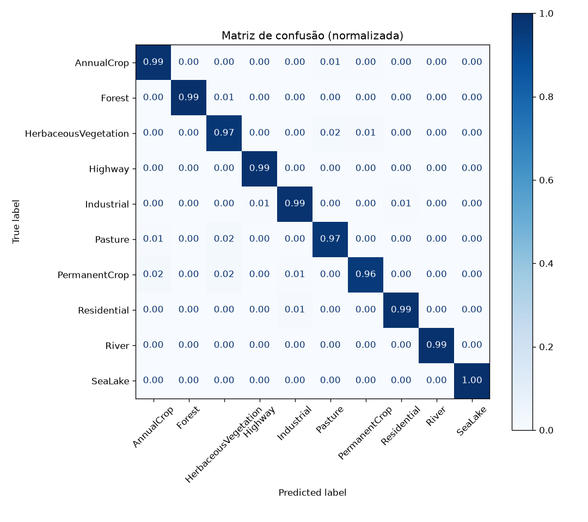
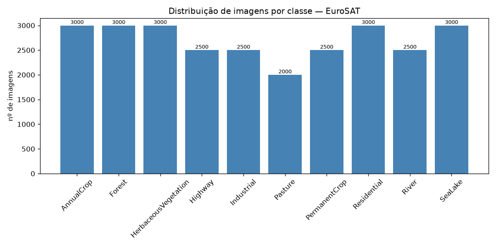

# EuroSAT Land-Use Classification — A Reproducible MLOps Pipeline

A professional, end-to-end image-classification pipeline on the **EuroSAT**
(Sentinel-2) dataset, built to demonstrate **MLOps best practices** rather than
just to train a model. Every experiment is reproducible: code, configuration,
data, and results are each versioned by the right tool.

<p align="left">
  
  
  
  
  
  
</p>

## Results

A **ResNet50** backbone (pretrained on ImageNet, fine-tuned for 5 epochs)
reaches **98.4% accuracy** and **0.984 macro-F1** on a held-out test set.

| Metric | Test set |
| --- | --- |
| Accuracy | **0.984** |
| Macro-F1 | **0.984** |
| Classes | 10 |
| Test images | 4,050 (held out, stratified) |

The diagonal confusion matrix below shows strong per-class performance; the few
residual errors are between visually similar vegetation classes
(PermanentCrop / HerbaceousVegetation / Pasture), which is expected.



> Macro-F1 ≈ accuracy is a deliberate metric choice: it confirms the model
> performs well across **all** classes, not just the larger ones — something
> overall accuracy alone can hide.

## Why this project

The goal is to show a *production-minded* workflow. The guiding principle:

> **Separate code (Git) from data (DVC) from configuration (Hydra) from
> results (W&B).** Each tool owns exactly one of these concerns, so any run is
> fully reproducible: `git commit + Hydra config + DVC data version → W&B metrics`.

| Tool | Concern it owns | Problem it solves |
| --- | --- | --- |
| **PyTorch + timm** | Model & training | Pretrained backbones (ResNet/ViT) behind one API; explicit, hand-written training loop |
| **Hydra** | Configuration | Composable YAML configs + CLI overrides — no magic numbers, every run's exact config saved |
| **Weights & Biases** | Experiment tracking | Live, comparable dashboards of metrics/curves/artifacts |
| **DVC** | Data & pipeline versioning | "Git for data": tiny pointers in Git, large data in remote storage; reproducible `dvc.yaml` pipeline |

## Exploratory Data Analysis

Before modelling, the raw data is explored in
[`notebooks/01_eda.ipynb`](notebooks/01_eda.ipynb): class meanings, balance,
image format, sample grids, and per-channel pixel statistics. Each finding is
tied back to a concrete pipeline decision (stratified split, macro-F1,
resize/normalization).



Key findings: 10 land-use classes; mildly imbalanced (1.5×, smallest class
Pasture); 64×64 RGB uint8 images; and per-channel statistics that differ from
ImageNet — which is precisely why ImageNet-normalized inputs are not centered at
zero, an expected consequence of reusing a pretrained backbone.

## Project structure

```
.
├── conf/                  # Hydra configs (data / model / training / wandb)
├── src/eurosat/
│   ├── data/              # dataset, stratified split, transforms
│   ├── models/            # timm model factory (ResNet / ViT)
│   ├── training/          # engine (train/eval loops), metrics, entrypoint
│   ├── evaluation/        # metrics report + confusion matrix
│   └── utils/             # reproducibility (seeding)
├── notebooks/             # 01_eda.ipynb — exploratory data analysis
├── tests/                 # 17 unit tests focused on the data pipeline
├── dvc.yaml               # reproducible pipeline: train → evaluate
├── params.yaml            # pipeline parameters tracked by DVC
├── Dockerfile             # reproducible runtime environment
└── pyproject.toml
```

## Getting started

```bash
# 1. Create a virtual environment and install the package
python -m venv .venv && source .venv/bin/activate
pip install -e ".[dev]"
# For CPU-only PyTorch, install torch/torchvision from the CPU index first:
#   pip install --index-url https://download.pytorch.org/whl/cpu torch torchvision

# 2. (Optional) pull the dataset version tracked by DVC
dvc pull
```

EuroSAT is downloaded automatically by `torchvision` on first run if not present.

## Usage

```bash
# Train (defaults: ResNet50, 5 epochs). Hydra lets you override anything on the CLI:
python -m eurosat.training.train
python -m eurosat.training.train model=vit training.epochs=10 data.batch_size=32

# Evaluate a checkpoint on the test set (writes metrics + confusion matrix)
python -m eurosat.evaluation.run checkpoint=outputs/<run>/best_model.pt

# Run the test suite
pytest

# Experiment tracking with Weights & Biases
export WANDB_API_KEY=<your-key>
python -m eurosat.training.train wandb.mode=online   # or: offline | disabled
```

> Note: `PYTHONPATH=src` is configured via `pyproject.toml`; if running without
> an editable install, prefix commands with `PYTHONPATH=src`.

### Run everything in Docker

```bash
docker build -t eurosat-mlops .
docker run --rm -e WANDB_API_KEY=$WANDB_API_KEY -v $PWD/data:/app/data eurosat-mlops
docker run --rm --entrypoint pytest eurosat-mlops      # run tests in the container
```

## Data & pipeline versioning (DVC)

The 224 MB dataset never enters Git — only a small `.dvc` pointer does. The
pipeline itself is declarative and cached:

```bash
dvc repro      # runs train → evaluate; skips stages whose inputs didn't change
dvc dag        # visualise the pipeline graph
dvc push/pull  # sync data & outputs with the configured remote
```

## MLOps practices demonstrated

- **Reproducibility** — global seeding, deterministic stratified splits, every
  run's exact config persisted by Hydra, data pinned by DVC.
- **Separation of concerns** — `data` / `models` / `training` / `evaluation`
  are decoupled; the training engine is framework-agnostic for logging.
- **Transfer learning** — fine-tuning vs. feature-extraction (frozen backbone),
  both selectable via config.
- **Honest evaluation** — per-class precision/recall/F1, macro-F1, and a
  confusion matrix on a never-seen test set.
- **Testing where it matters** — unit tests target the data pipeline (split
  leakage, stratification, normalization), where ML's silent bugs hide.
- **Containerisation** — a single `Dockerfile` reproduces the full environment.

## Dataset

[EuroSAT](https://github.com/phelber/EuroSAT) — 27,000 labelled 64×64 Sentinel-2
RGB image patches across 10 land-use/land-cover classes.

## License

Released under the MIT License.
